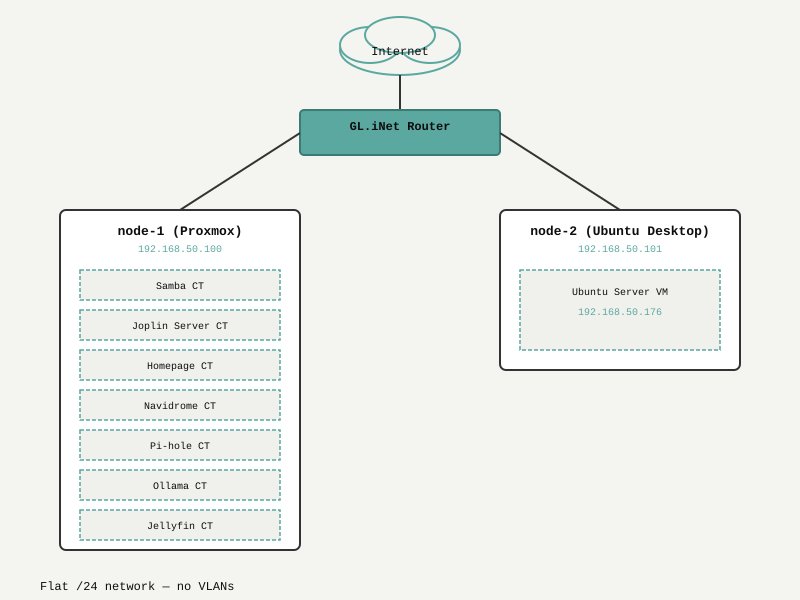

# Network Topology

## Physical Layout

- **Router:** GL.iNet GL‑SFT1200 (Opal) – connects Personal Network to Internet
- **Nodes:** Both Dell OptiPlex 7010 USFF are wired to the router
- **Network:** Flat /24 subnet, no managed switch or VLANs (yet)

## IP Addressing

| Host | IP | Role |
|------|----|------|
| Router | 192.168.50.1 | DHCP, gateway, DNS |
| pve-1 (Node1) | 192.168.50.100 | Proxmox host, storage root |
| pve-2 (Node2) | 192.168.50.101 (planned) | Second Proxmox host |
| samba-ct | 192.168.50.110 | Samba file server (CT on pve-1) |
| dev-vm | 192.168.50.176 | Ubuntu Server development VM |
| Other CTs | 192.168.50.111‑116 | To be assigned (see VMs & Containers) |

All devices are also reachable via Tailscale (100.x.y.z addresses).

## Traffic Flow

```
Internet  
│  
GL.iNet Router (192.168.50.1)  
│  
├── pve-1 (Proxmox)  
│ ├── Samba CT (bind‑mount /mnt/storage)  
│ ├── Joplin Server CT  
│ ├── Homepage CT  
│ ├── Navidrome CT  
│ └── Jellyfin CT  
│  
└── pve-2 (Proxmox)  
├── Pi‑hole CT  
├── Ollama CT  
└── Ubuntu Server VM
```


## Diagram



